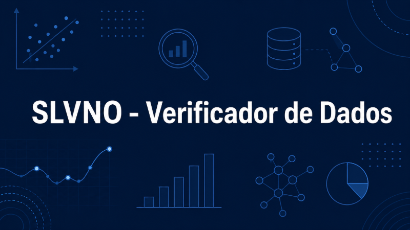

## Sobre o projeto

O SLVNO - Verificador de Dados é uma aplicação desenvolvida para automatizar a etapa inicial de validação de bases de dados. O projeto permite que o usuário envie arquivos CSV ou Excel e receba um diagnóstico da qualidade da base, incluindo resumo geral, perfil das colunas, valores ausentes, linhas duplicadas, tipos suspeitos, categorias inconsistentes, possíveis outliers, score de qualidade e relatório exportável em Excel.

O problema que o projeto resolve é uma dor comum de analistas de dados: antes de criar dashboards, análises ou modelos, muitas vezes é necessário gastar tempo verificando manualmente se a base possui erros, campos vazios, inconsistências ou problemas de estrutura. A ferramenta reduz esse trabalho inicial e ajuda a identificar rapidamente pontos que precisam de tratamento.

## Tecnologias utilizadas

- Python
- Streamlit
- Pandas
- Plotly
- OpenPyXL
- XlsxWriter
- RapidFuzz
- Unidecode

## Acesse o projeto

[Abrir no Streamlit](https://slvno-verificador-dados.streamlit.app/){target="_blank" .btn .btn-primary}

